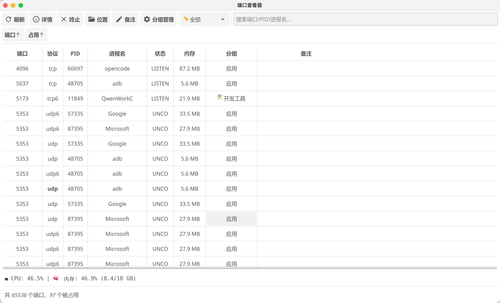
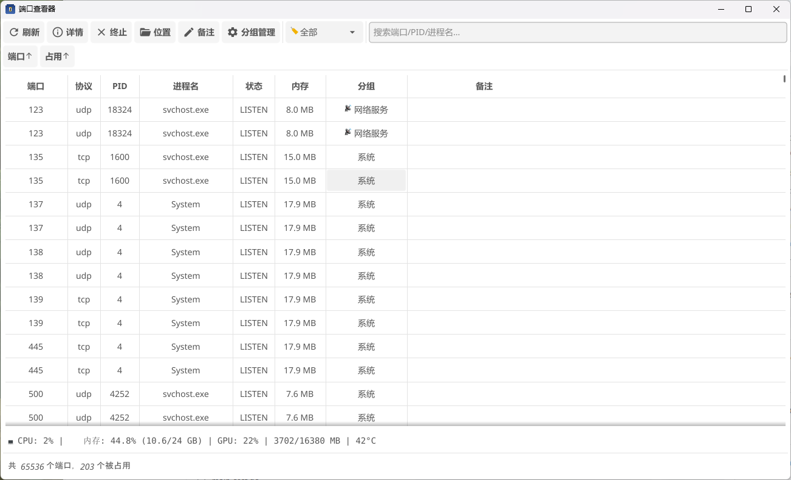

# PortView 端口查看器

跨平台端口扫描与进程管理工具，Go + Fyne 构建。

> 🤖 Vibe Coding — 全程由 DeepSeek 辅助编码

## 截图

| macOS | Windows |
|-------|---------|
|  |  |

## 功能

- 查看 0–65535 端口的 TCP/UDP socket，包括监听和已连接状态，识别占用进程
- 进程详情：PID、内存、可执行路径
- Kill 进程、打开可执行文件位置
- 自定义分组管理，端口备注持久化
- 按端口排序、按占用状态/协议筛选
- 关键词搜索（端口号 / PID / 进程名）

## 安装

### Linux

```bash
# .deb
sudo dpkg -i portview_*.deb

# .rpm
sudo rpm -i portview-*.rpm

# AppImage
chmod +x portview-*.AppImage && ./portview-*.AppImage
```

> ⚠️ Linux 下普通用户运行 `ss -taunp` 无法获取其他用户的进程 PID，PID 可能不可见；此时仍显示端口占用状态。如需完整进程信息，请用 `sudo ./portview` 运行。

### macOS

打开 `.dmg`，将 PortView 拖入 `Applications` 文件夹。

> ⚠️ 首次运行提示「无法验证开发者」时，执行：
> ```bash
> sudo xattr -rd com.apple.quarantine /Applications/PortView.app
> ```
> 然后重新双击打开即可。这是由于应用未经过 Apple 签名公证。

### Windows

双击 `portview.exe`。

## 开发

```bash
git clone git@github.com:cqiang102/portview.git
cd portview
go build -o portview .
./portview
```

依赖：Go 1.26.5+、Fyne v2。

- Linux 需 `libgl1-mesa-dev xorg-dev` 及 `ss`（iproute2，通常预装）
- macOS 需 Xcode Command Line Tools（`lsof` 系统自带）
- Windows 交叉编译需 `mingw-w64`

## 构建与打包

```bash
# 本地构建
go build -ldflags="-s -w" -o portview .

# Windows 交叉编译（Linux 上需 mingw64）
GOOS=windows GOARCH=amd64 CGO_ENABLED=1 CC=x86_64-w64-mingw32-gcc \
  go build -ldflags="-s -w -H windowsgui" -o portview.exe .
```

CI 通过 GitHub Actions 自动构建：

| 平台 | 产物 | 架构 |
|------|------|------|
| Linux | `.deb` `.rpm` `.AppImage` | x86_64 |
| macOS | `.dmg` | arm64 |
| Windows | `.exe` | x86_64 |

## 协议

Apache 2.0 © lacia.cq@qq.com

## 数据与扫描口径

- “未观测到占用”表示本次系统查询未返回该端口，不能保证端口可绑定；查询结果受权限和采样时刻影响。
- 同一端口可有多条 socket 记录；状态栏按端口号去重统计占用数。
- 分组支持多选，备注窗口与分组管理共用同一份端口归属数据。
- 已有的 `~/.portview/notes.json` 会继续使用；新安装使用系统用户配置目录下的 `PortView/notes.json`（macOS 为 `~/Library/Application Support/PortView/notes.json`，Windows 为 `%AppData%/PortView/notes.json`，Linux 为 `$XDG_CONFIG_HOME/PortView/notes.json`，默认 `~/.config/PortView/notes.json`）。旧版 JSON 备注格式会自动迁移。

## 代码结构与验证

- `main.go`：应用启动与配置加载。
- `viewer.go`、`refresh.go`：窗口状态、后台扫描和 UI 线程更新。
- `ui.go`：主界面构建；`groups_ui.go`、`notes_ui.go`、`process_ui.go`：分组、备注和进程交互。
- `filter.go`、`model.go`：独立于 GUI 的筛选、排序与端口模型。
- `scan*.go`、`pwsh*.go`：平台采集和命令执行；`store.go`：配置迁移与事务式保存。

```bash
go test -race -cover ./...
go vet ./...
go build -o portview .
```
